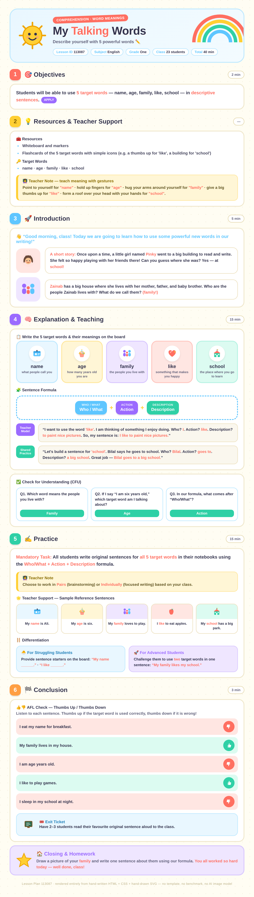
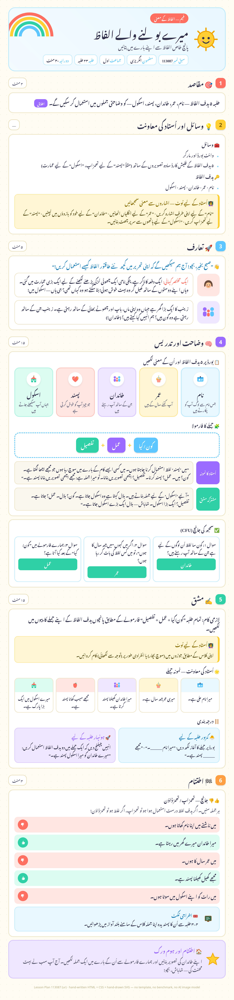
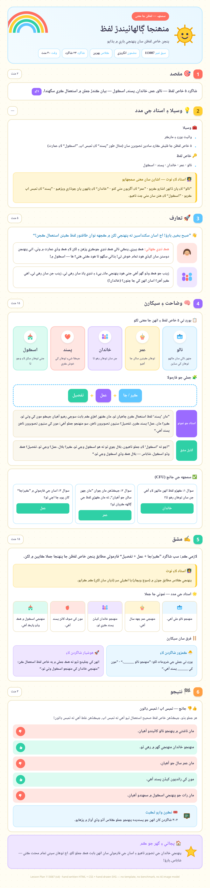
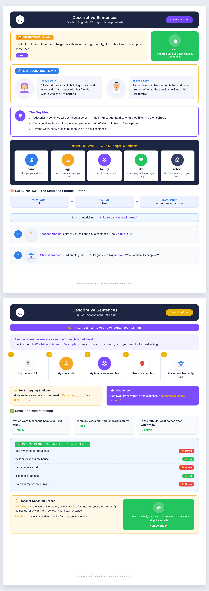
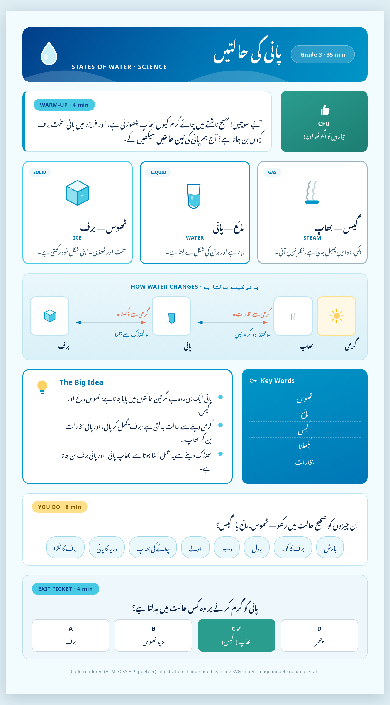
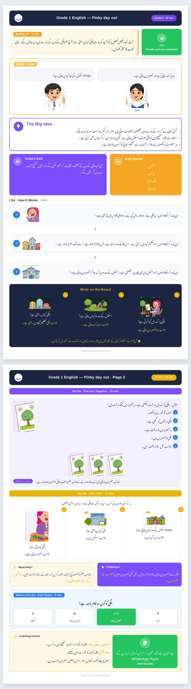
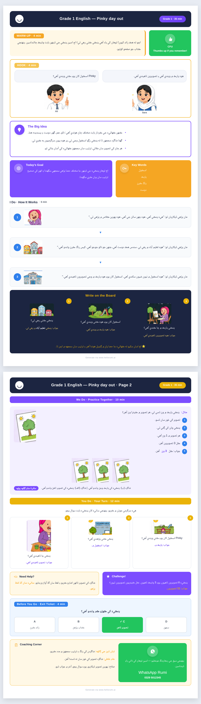
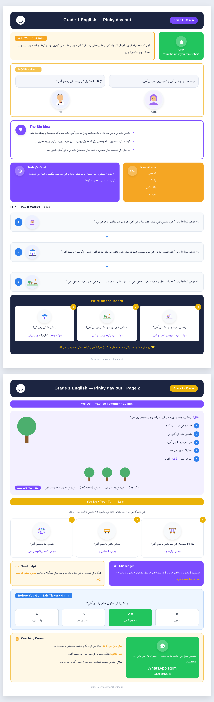
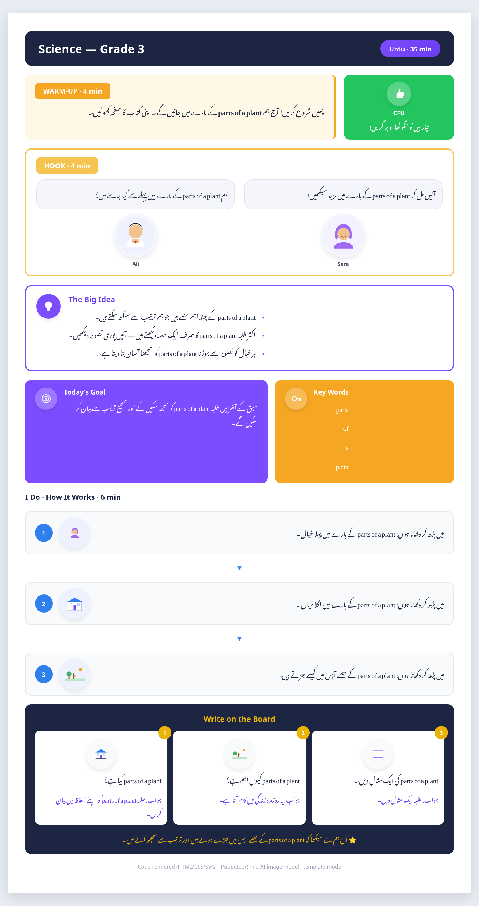
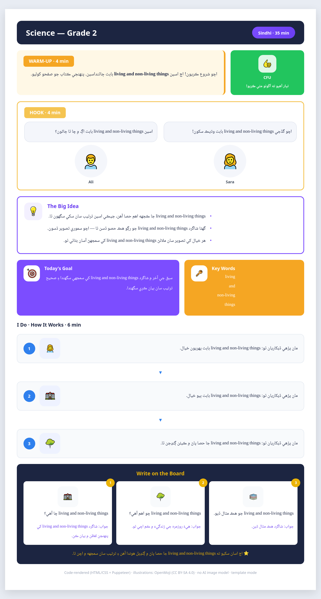

# HTML vs Image

Lesson plans designed in HTML and rendered into print-ready **PNG images** using [Puppeteer](https://pptr.dev/) (headless Chrome). Each lesson plan is a single HTML file — a full-page screenshot turns it into an image.

## Grade 1 · English

### پنکی کا دن — Pinky's Day


[HTML source](index.html) · [Full image](assets/lesson-plan.png)

---

## How it's made

```bash
npm install     # one time — installs Puppeteer + Chromium
node render.js  # renders index.html into lesson-plan.png
```

To add a new lesson plan, edit `index.html`, run `node render.js`, then save the new image into `assets/` and add it to the gallery above.

## Running it

Prerequisites: Node.js 20+. **No AI image model is used at any step** — images are rendered from code.

```bash
npm install
npm test           # run the unit tests
npm run render     # render index.html -> lesson-plan.png
npm run benchmark  # (optional, needs an Anthropic API key) benchmark Claude models
```

Everything is produced by rendering HTML/CSS/SVG with Puppeteer (no image AI). An Anthropic API key is only needed for the optional Claude-generated content path.

## nano-banana vs code-rendered

See **[docs/comparison.html](docs/comparison.html)** — a side-by-side comparison (cost, latency, quality) of a nano-banana image vs the code-rendered version. (The reference lesson plan we reproduce was itself generated by nano-banana.)

## Generated lesson plans

### English — Lesson 113087 · Descriptive Sentences (Grade 1) — full plan, original design


English · Grade One · Comprehension (Word Meanings) · 23 students. The **complete** lesson plan (Lesson ID 113087) — every section rendered in one colourful, UI/UX-driven poster: objectives, resources + gesture notes, introduction (Pinky & Zainab), explanation (word wall, sentence formula, teacher modelling, shared practice, CFU), practice (mandatory task, sample sentences, differentiation) and conclusion (thumbs-up/down AFL, exit ticket, homework). A **from-scratch** design — own palette, own layout, and **every illustration hand-drawn as inline SVG** (sun mascot, rainbow, name-tag, cake, family, heart, schoolhouse, apple, thumbs, Pinky). No template, no benchmark, no dataset, no AI image model. Source: [lesson-113087-full.html](lesson-113087-full.html).

### Urdu &amp; Sindhi — Lesson 113087 · Descriptive Sentences (Grade 1) — RTL, full plan
 

The same complete Lesson 113087 in **Urdu** (Noto Nastaliq Urdu) and **Sindhi** (Noto Naskh Arabic) — full right-to-left layout, large clear script, every section translated. Same from-scratch colourful design with hand-drawn inline SVG; no template, no benchmark, no AI image model. Sources: [lesson-113087-ur.html](lesson-113087-ur.html) · [lesson-113087-sd.html](lesson-113087-sd.html) (built from [scratch-multilang.js](scratch-multilang.js)). _Sindhi text is machine-translated — recommend a native-speaker review before classroom use._

### English — Descriptive Sentences (Grade 1) — original design, hand-coded SVG art


English · Grade 1 — writing descriptive sentences with 5 target words (name, age, family, like, school). A **from-scratch** two-page design with a colour-coded word wall, sentence-formula strip, illustrated sample sentences, thumbs-up/down assessment and a coaching corner. **Every icon and character is hand-coded inline SVG** (person, cake, family, heart, school, apple, Ali/Sara). No template art, no dataset, no AI image model. Source: [lesson-descriptive-sentences.html](lesson-descriptive-sentences.html).

### States of Water (Urdu) — original design, hand-coded SVG art


Science · Grade 3 · Urdu — پانی کی حالتیں. A **from-scratch** design (not the shared template) with **topic-relevant illustrations hand-coded as inline SVG** (ice cube, water glass, steam, sun, a solid→liquid→gas transition diagram). No template reuse, no OpenMoji/dataset art, no AI image model. Source: [references/samples/states-of-water.html](references/samples/states-of-water.html).

### Pinky day out (Urdu) — code-rendered, Nastaliq


Urdu · Grade 1 — Pinky day out. Same lesson as the Sindhi reference, translated to Urdu and rendered in proper **Noto Nastaliq Urdu** _(hand-authored HTML → Puppeteer, no AI image model)_.

### Pinky day out (Sindhi) — full reproduction reusing every reference illustration


Code-rendered reproduction of the nano-banana reference — layout & Sindhi text are real code, and **every illustration is the exact art cropped from the reference** (Ali, Sara, houses, park, painting, school, bus, bench, trees). No AI image model. Rebuild via `python3 scripts/build-reference-repro.py`.

### English — Pinky day out (Sindhi)


English · Grade 1 · Sindhi — Pinky day out _(hand-authored HTML → Puppeteer (no AI image model))_

### Science — parts of a plant (Urdu)


Science · Grade 3 · Urdu — parts of a plant _(template (no API key) · $0.00000 · 0ms)_

### Science — living and non-living things (Sindhi)


Science · Grade 2 · Sindhi — living and non-living things _(template (no API key) · $0.00000 · 0ms)_
